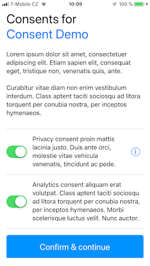

# ConsentSDK for iOS

Obtaining explicit user consent with gathering analytics data in an app, or with processing user’s personal data is important part of establishing user trust and seamless user experience.

It is also an obligation of an app developer stated in [App Store Guidelines](https://developer.apple.com/app-store/review/guidelines/) (2.5.14 and 5.1.2), necessary to fulfil in order to get your app approved for distribution. If your app e.g. uses a 3rd party tool for analytics, it is the sole responsibility of you as the app developer, not of the 3rd party tool provider, that the analytics tool does not start registering events in the app without user explicit consent.

Although implementing some dialog to obtain user consents and store them for further reference seems pretty straightforward, digging into it reveals (as usual with “_simple tasks_”) many programming and design details that must be implemented, which are not the core functionality of your app. 

So why not use or reuse some ready-made SDK?

[](readme/ConsentSDK-Screenshot-iPhone.png) &nbsp;&nbsp;&nbsp;&nbsp;&nbsp; [](readme/ConsentSDK-Screenshot-iPad.png)

## What ConsentsSDK does. 

This SDK:
- provides a configurable control panel where user selects her privacy options
- stores the selected user preferences to be used in your app
- works both with Swift and Objective-C apps
- all texts are fully localizable
- privacy policies may be provided by an external web page that is presented w/out leaving the app (see [localisation](#localisation).)

## Code examples
### Simple example 
The most straightforward use that utilises default settings:
```swift
ConsentSDK.check() {
      if ConsentSDK.consent(for: .analytics) == .provided {
          // Start analytics tools
      }
}
```

This method first checks if the user already provided/rejected consent for both `privacy` and `analytics`. If not, the privacy control panel is shown with build-in defaults (consent is provided for both). When user agrees, the callback is called to let you handle the user preferences. 

In the case user previously went though these settings, the control panel is not show and the callback is called straight away.

### Complex example 

In this example, only consent for analytics is sought for with the consent provided by default.

```swift
var panelSettings = CSDKControlPanelSetting()
//panelSettings[.privacy] = .notProvided
panelSettings[.analytics] = .provided

ConsentSDK.check(with: panelSettings) {
      if ConsentSDK.consent(for: .analytics) == .provided {
          // Start analytics tools
      }
}
```

## API
{TBD}
- enumerations
- functions
	- ConsentSDK.check() {}
	- ConsentSDK.show() {}

## Localisation
The texts shown in the control panel are configured using the standard `Localizable.strings` mechanism. `Localizable.strings`  are also used to provide an optional URL of a detailed policy information (thus the link is localised as well).
